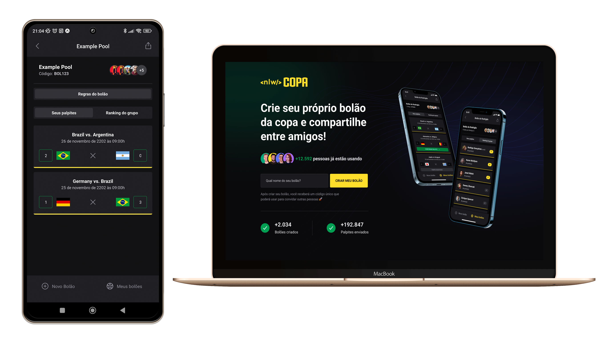

<h1 align="center">
    
</h1>

<h4 align="center">
  Bolão da Copa do Mundo, se divertindo e ganhando ⚽
</h4>

<p align="center">
  

  
  
  <a href="https://github.com/thiagoperesbr/nlw-copa/commits/master">
    
  </a>

  
  
  <a href="https://www.linkedin.com/in/thiagoperes/">
    
  </a>
</p>

<p align="center">
  
</p>

## 💻 Projeto

NLW-Copa - é uma plataforma para criação de Bolões da Copa do Mundo, para você se divertir com seus amigos!

Projeto desenvolvido durante a NLW - Next Week Level oferecida pela [Rocketseat](https://rocketseat.com.br).
A NLW - Next Week Level é uma experiência online gratuita com muito conteúdo prático, onde o conteúdo fica disponível durante uma semana.

## 💻 Layout

O layout da aplicação está disponível no Figma:

<a href="https://www.figma.com/file/k0VAfc9zyfWLK2EXfZl08D/Bol%C3%A3o-da-Copa-(Community)?node-id=0%3A1&t=otRHKDxt1yWJIn8i-0">
  
</a>

## 💻 Deploy

O deploy da aplicação está disponível abaixo:

### Frontend

[](https://nlw-copa-tpbr.vercel.app/)

### Backend

[](https://nlw-copa-6d80.onrender.com)

## 🚀 Tecnologias

Esse projeto foi desenvolvido com as seguintes tecnologias:

### Frontend

- [Next.js](https://nextjs.org/)
- [TypeScript](https://www.typescriptlang.org/)
- [TailwindCSS](https://tailwindcss.com/)

### Backend

- [Node.js](https://nodejs.org/en/)
- [Fastify](https://www.fastify.io/)
- [Prisma](https://www.prisma.io/)
- [SQLite](https://www.sqlite.org/index.html)

### Mobile

- [ReactNative](https://nodejs.org/en/)
- [Expo](https://nodejs.org/en/)
- [NativeBase](https://nativebase.io/)

## 🚀 Instalação e execução

Podemos considerar este projeto como sendo divido em três partes:
1. Back End (pasta server) 
2. Front End (pasta web)
3. Mobile (pasta mobile)

💡 Tanto o Front End quanto o Mobile precisam que o Back End esteja sendo executado para funcionar.

### Pré-requisitos

Antes de começar, você vai precisar ter instalado em sua máquina as seguintes ferramentas:
1. [Git](https://git-scm.com)
2. [Node.js](https://nodejs.org/en/)
3. [VSCode](https://code.visualstudio.com/)

### 🎲 Rodando o servidor (Back End)

```bash
# Clone este repositório
$ git clone https://github.com/thiagoperesbr/nlw-copa.git
# Acesse a pasta do projeto no terminal/cmd
$ cd nlw-copa
# Vá para a pasta do back end
$ cd server
# Instale as dependências
$ npm install
# Execute a aplicação em modo de desenvolvimento
$ npm run dev
# O servidor inciará na porta:3333 - acesse http://localhost:3333 
```

### 🧭 Rodando a aplicação web (Front End)

```bash
# Clone este repositório
$ git clone https://github.com/thiagoperesbr/nlw-copa.git
# Acesse a pasta do projeto no seu terminal/cmd
$ cd nlw-copa
# Vá para a pasta do front end
$ cd web
# Instale as dependências
$ npm install
# Execute a aplicação em modo de desenvolvimento
$ npm run dev
# A aplicação será aberta na porta:3000 - acesse http://localhost:3000
```

### 📱Rodando a aplicação mobile (Mobile)

```bash
# Clone este repositório
$ git clone https://github.com/thiagoperesbr/nlw-copa.git
# Acesse a pasta do projeto no seu terminal/cmd
$ cd nlw-copa
# Vá para a pasta da aplicação Mobile
$ cd mobile
# Instale as dependências
$ npm install
# Instale o Expo App no seu celular (rodar simulador)
# Execute a aplicação mobile
$ npx expo start
# A aplicação será aberta no seu celular (Expo App)
```

## 😯 Como contribuir para o projeto

1. Faça um **fork** do projeto.
2. Crie uma nova branch com as suas alterações: `git checkout -b my-feature`
3. Salve as alterações e crie uma mensagem de commit contando o que você fez: `git commit -m "feature: My new feature"`
4. Envie as suas alterações: `git push origin my-feature`
> Caso tenha alguma dúvida confira este [guia de como contribuir no GitHub](https://github.com/firstcontributions/first-contributions)


## :memo: Licença

Esse projeto está sob a licença MIT. Veja o arquivo [LICENSE](https://github.com/thiagoperesbr/nlw-copa/blob/master/LICENSE) para mais detalhes.

Feito por Thiago Mourão Peres 👋🏽 [Entre em contato!](https://www.linkedin.com/in/thiagoperes/)
